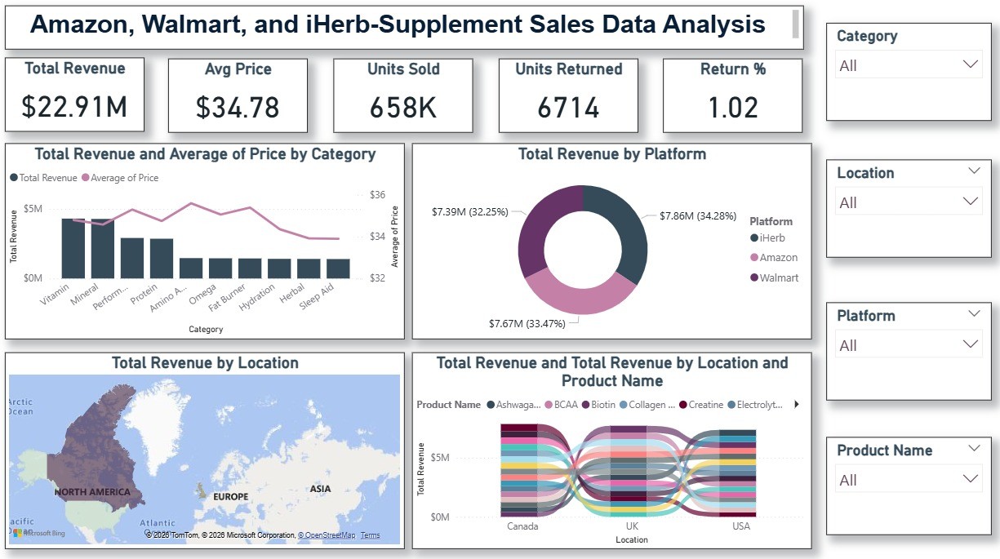

# FUTURE_DS_01 – Supplement Sales Dashboard from E-commerce Data

## 📊 Internship
Data Science & Analytics Internship  
Organization: Future Interns

## 🎯 Task Objective
To analyze supplement e-commerce sales data and create an interactive sales
dashboard using Power BI to identify revenue trends, top-performing categories,
and platform-wise performance.

## 🛠 Tools Used
- Power BI

## 📌 Key Metrics
- Total Revenue: $22.91M
- Average Price: $34.78
- Units Sold: 658K
- Return Rate: 1.02%

## 📈 Dashboard Highlights
- Category-wise revenue analysis for supplement products
- Platform-wise sales comparison (Amazon, Walmart, iHerb)
- Location-wise sales performance
- Product-level revenue flow
- Interactive slicers for category, platform, and location
- Analysis focused on health and supplement product sales

## 🔍 Insights
- Amazon generates the highest revenue among platforms.
- Vitamins and Minerals are the top-performing supplement categories.
- USA contributes the highest share of total revenue.
- Low return rate indicates strong customer satisfaction.

## 📷 Dashboard Preview

- Location-wise sales performance
- Product-level revenue flow
- Interactive slicers for category, platform, and location
- Analysis focused on health and supplement product sales

## 🔍 Insights
- Amazon generates the highest revenue among platforms.
- Vitamins and Minerals are the top-performing supplement categories.
- USA contributes the highest share of total revenue.
- Low return rate indicates strong customer satisfaction.

## 📷 Dashboard Preview

## 📁 Files Included
- supp data sales.pbix
- Dashboard image)

## 📁 Files Included
- supp data sales.pbix
- Dashboard image
